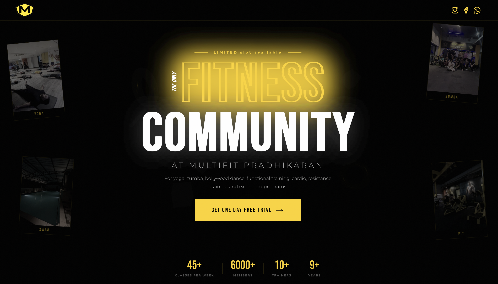
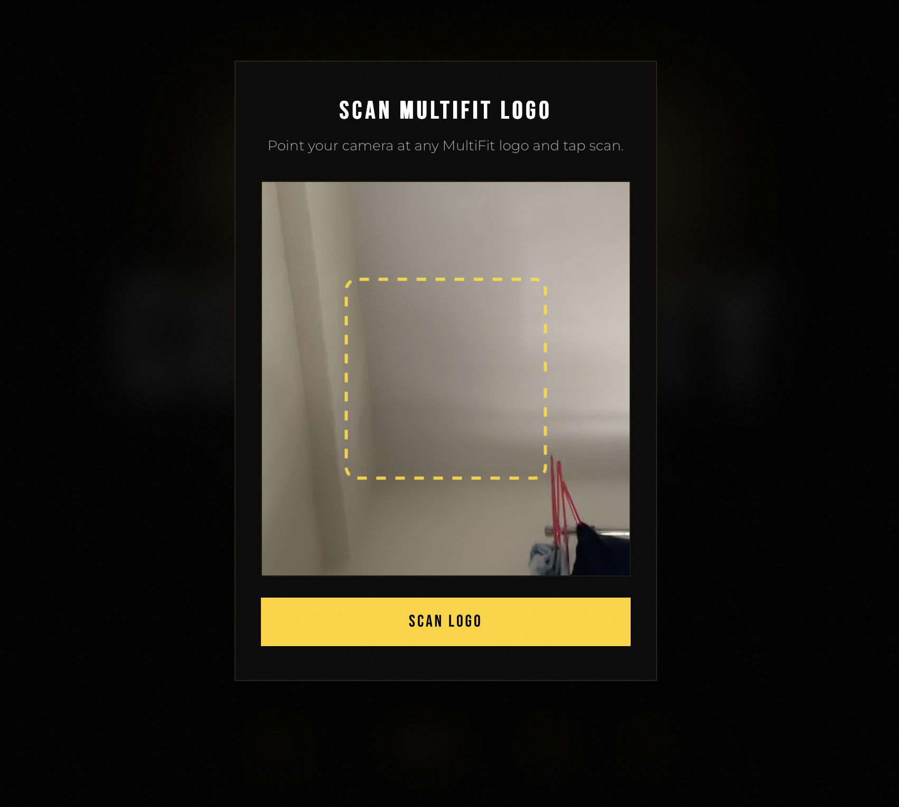
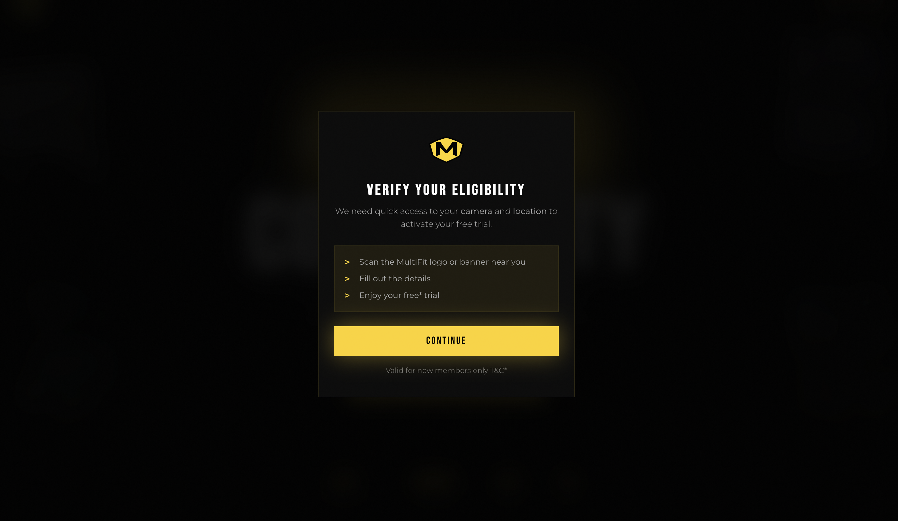
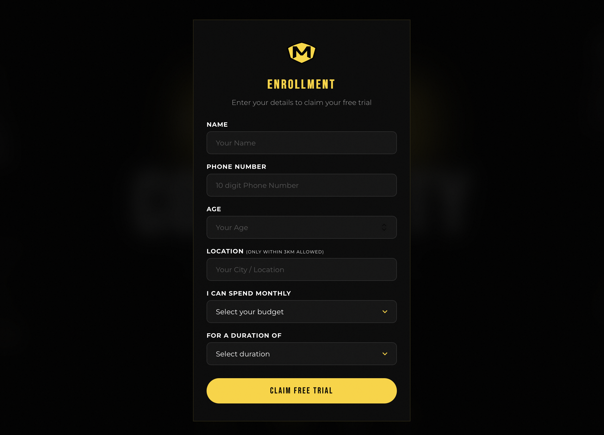

# MultiFit Pradhikaran | Free Trial Landing Page

A modern landing page created for **MultiFit Pradhikaran** to help users check their eligibility for a free gym trial and submit their enrollment details.

The project combines **web development, computer vision, and geolocation** to create a more interactive user experience. It uses YOLOv8 with TensorFlow.js to detect the MultiFit logo and browser geolocation to check whether the user is within the required area.

## 🚀 Live Demo

https://multifit-yolo.vercel.app/

## 📌 About the Project

This project was developed as an interactive free-trial landing page for MultiFit Pradhikaran.

Instead of using a simple registration form, the website adds an AI-based logo detection step and a location check before allowing users to continue with the enrollment process.

The project also connects the enrollment form with Google Sheets so that submitted user details can be collected for lead management.

## ✨ Features

- 🎯 **MultiFit Logo Detection**
  - Uses YOLOv8 to detect the MultiFit logo.
  - Runs the detection directly in the browser using TensorFlow.js.

- 📍 **Location-Based Eligibility**
  - Uses the browser's Geolocation API.
  - Checks whether the user is within approximately 3 km of the target location.

- 📝 **Free Trial Enrollment**
  - Provides a simple form for users interested in the gym's free trial.

- 📊 **Google Sheets Integration**
  - Sends enrollment information to Google Sheets for lead collection and management.

- 📱 **Responsive Design**
  - Designed to work across desktop and mobile screen sizes.

- ⚡ **Client-Side AI Processing**
  - AI inference is handled in the browser using TensorFlow.js.

- 🎨 **Interactive User Interface**
  - Includes a modern landing page with interactive elements and visual sections.

## 🤖 AI & Computer Vision

One of the main features of this project is the use of **YOLOv8 object detection**.

The YOLO model is used with **TensorFlow.js**, allowing the application to perform object detection directly in the browser.

The application uses the model to identify the MultiFit logo during the verification process.

This project helped me understand how a computer vision model can be integrated into a real-world web application rather than being used only in a Python environment.

## 📍 Location Verification

The website uses the browser's **Geolocation API** to obtain the user's location.

The application then checks whether the user is within approximately **3 km** of the MultiFit Pradhikaran location.

This provides an additional eligibility check before the user proceeds with the free-trial registration.

## 📊 Google Sheets Lead Capture

The enrollment form is connected with **Google Sheets** to store submitted lead information.

This makes it easier to collect and manage registrations generated through the landing page.

## 🔄 How It Works

```text
User visits the landing page
        ↓
MultiFit logo verification
        ↓
YOLOv8 object detection
        ↓
Location eligibility check
        ↓
Free trial enrollment form
        ↓
Lead information submitted
        ↓
Google Sheets
```

## 📸 Screenshots

### 🏠 Home Page


### 📷 Logo Detection


### 📝 Enrollment Form


### 📋 Details / Verification

